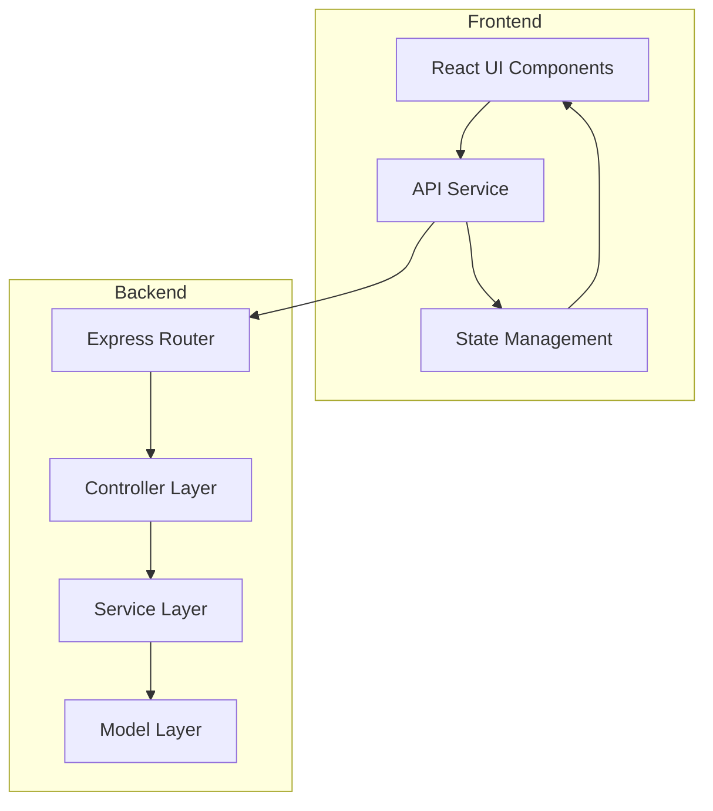
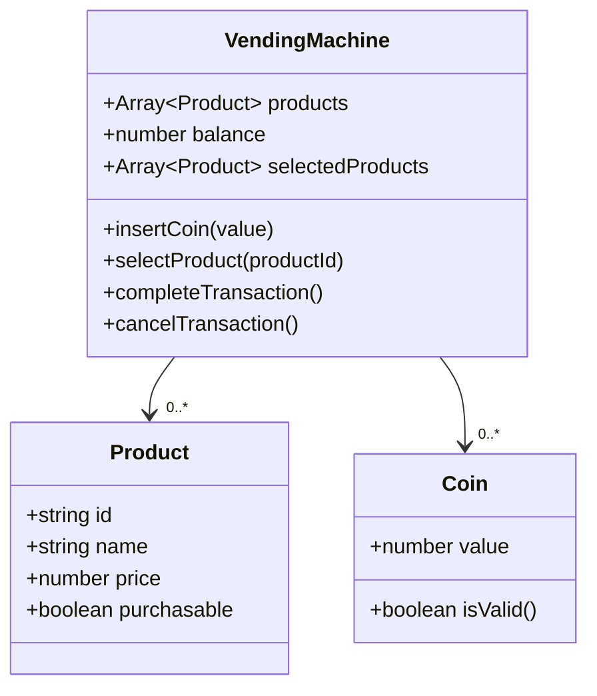

# Vending Machine Application

A modern, full-stack vending machine application built with Node.js backend API and React TypeScript frontend, featuring real-time balance updates, product management, and transaction handling with optimal change calculation.

## 🏗️ Architecture Overview

### System Architecture



### Class Diagram




## 🔧 Technical Stack

### Backend

- **Node.js** with Express.js
- **RESTful API** design
- **Jest** for unit testing
- **Modular architecture** with clear separation

### Frontend

- **React 18** with TypeScript
- **Vite** for fast development and building
- **Tailwind CSS** for styling
- **Modern React patterns** (hooks, functional components)
- **Axios** for API requests
  
## 🚀 Features

### Backend API

- **RESTful API Design**: Clean, intuitive endpoints following REST principles
- **Modular Architecture**: Clear separation of concerns with MVC pattern
- **Design Patterns**: Singleton, Factory, and Service Layer patterns
- **Transaction Management**: Atomic transactions with optimal change calculation
- **Comprehensive Testing**: Unit tests with high coverage
- **Input Validation**: Robust validation for all inputs

### Frontend

- **Modern React with TypeScript**: Type-safe development with latest React features
- **Real-time Updates**: Live balance and product availability updates
- **Interactive UI**: Intuitive product selection and shopping cart
- **Responsive Design**: Mobile-first design with Tailwind CSS
- **Error Handling**: Comprehensive error handling with user-friendly messages

## 📁 Project Structure

```

├── backend/
│   ├── src/
│   │   ├── controllers/     # HTTP request handlers
│   │   ├── models/          # Core business logic and data models
│   │   ├── routes/          # API endpoint definitions
│   │   ├── services/        # Business logic layer
│   │   ├── tests/           # Unit tests
│   │   └── app.js           # Application entry point
│   ├── package.json
│   └── README.md
├── frontend/
│   ├── src/
│   │   ├── components/      # React components
│   │   │   ├── Cart.tsx     # Shopping cart component
│   │   │   ├── CoinInserter.tsx # Coin insertion interface
│   │   │   └── ProductList.tsx  # Product display grid
│   │   ├── services/
│   │   │   └── api.ts       # API integration service
│   │   └── App.tsx          # Main application component
│   ├── package.json
│   └── vite.config.ts
└── README.md
```

## 🛠️ Installation and Setup

### Prerequisites

- Node.js (v14 or higher)
- npm (v6 or higher)

### Quick Start

1. **Clone and install dependencies:**

```bash
git clone https://github.com/MohaElbadry/VendingMachine
cd vending-machine
npm install
```

2. **Start the application:**

```bash
# Start both frontend and backend
npm start

# Or start them separately:
npm run start:api     # Start backend only (port 3000)
npm run start:front   # Start frontend only (port 5173)
```

3. **Access the application:**

- Frontend: [http://localhost:5173](http://localhost:5173)
- Backend API: [http://localhost:3000](http://localhost:3000)

### Running Tests

```bash
# Backend tests
cd vending-machine-API
npm test
```

## 🔗 API Documentation

### Available Endpoints

| Method | Endpoint                          | Description                                 |
| ------ | --------------------------------- | ------------------------------------------- |
| GET    | `/api/products`                   | Get all products with purchasability status |
| POST   | `/api/coins`                      | Insert a coin into the machine              |
| GET    | `/api/balance`                    | Get current balance in the machine          |
| POST   | `/api/products/:productId/select` | Select a product by ID                      |
| POST   | `/api/transaction/complete`       | Complete transaction and dispense products  |
| POST   | `/api/transaction/cancel`         | Cancel transaction and refund money         |

### API Testing with cURL

#### 1. Get all products

```bash
curl http://localhost:3000/api/products

```


#### 2. Insert a coin (5 MAD)

```bash
curl -X POST http://localhost:3000/api/coins \
  -H "Content-Type: application/json" \
  -d '{"value": 5}'
```


#### 4. Select a product

```bash
curl -X POST http://localhost:3000/api/products/1/select \
  -H "Content-Type: application/json"
```


#### 5. Complete transaction

```bash
curl -X POST http://localhost:3000/api/transaction/complete \
  -H "Content-Type: application/json"
```


#### 6. Cancel transaction

```bash
curl -X POST http://localhost:3000/api/transaction/cancel \
  -H "Content-Type: application/json"
```


## 🎯 Usage Examples

### Scenario 1: Buy a single product

1. **Insert 5 MAD:**

   ```bash
   POST /api/coins
   { "value": 5 }
   ```

2. **Select a soda (3.5 MAD):**

   ```bash
   POST /api/products/1/select
   ```

3. **Complete the transaction:**
   ```bash
   POST /api/transaction/complete
   ```
   **Response:** Soda dispensed, 1.5 MAD change returned

### Scenario 2: Buy multiple products

1. **Insert 5 MAD + 2 MAD (total: 7 MAD)**
2. **Select soda (3.5 MAD) + TikTak (2 MAD)**
3. **Complete transaction**
4. **Result:** Both products dispensed, 1.5 MAD change returned

## 🖼️ Frontend Interface

### Main Interface & Product Selection and Cart


### Transaction Completion


## 🧠 Design Decisions and Patterns

### 1. **Coin Management**

- **Valid denominations:** 0.5, 1, 2, 5, 10 MAD
- **Optimal change calculation:** Greedy algorithm for minimal coin count
- **Real-time balance updates:** Immediate UI feedback

### 2. **Product Management**

- **Dynamic availability:** Real-time purchase validation based on balance
- **Price-based validation:** Prevent selection of unaffordable items
- **Stock simulation:** Realistic vending machine behavior

### 3. **Transaction Flow**

- **Multi-product support:** Shopping cart functionality
- **Atomic transactions:** All-or-nothing transaction processing
- **Automatic change calculation:** Optimal coin distribution

### 4. **Error Handling**

- **Input validation:** Comprehensive validation for all user inputs
- **Clear error messages:** User-friendly error descriptions
- **Graceful failure recovery:** Robust error handling without crashes

### 5. **Architecture Patterns**

- **Singleton Pattern:** VendingMachineService ensures single instance
- **MVC Architecture:** Clean separation of concerns
- **Service Layer Pattern:** Business logic abstraction
- **Factory Pattern:** Product creation and management

## 🎯 Key Features Implemented

### Core Functionality

- ✅ Coin insertion with validation
- ✅ Product selection with balance checking
- ✅ Multi-product shopping cart
- ✅ Transaction completion with change calculation
- ✅ Transaction cancellation with full refund
- ✅ Real-time balance updates

### Additional Features

- ✅ Responsive design for all devices
- ✅ Comprehensive error handling
- ✅ Unit tests with good coverage
- ✅ Clean, maintainable code structure
- ✅ RESTful API design
- ✅ Modern React patterns

## 🚀 Future Enhancements

- History tracking of transactions
- User authentication and profiles
- admin interface for product management
- Payment integration (credit cards, mobile payments)
- Product inventory management
- Sales reporting and analytics
- Admin dashboard for configuration
- Multi-language support
- Advanced product recommendations

## 📄 License

This project is developed as part of a technical assessment and is available for review and evaluation purposes.

---

**Developed by Mohammed** | **Zenika  Technical Assessment**
