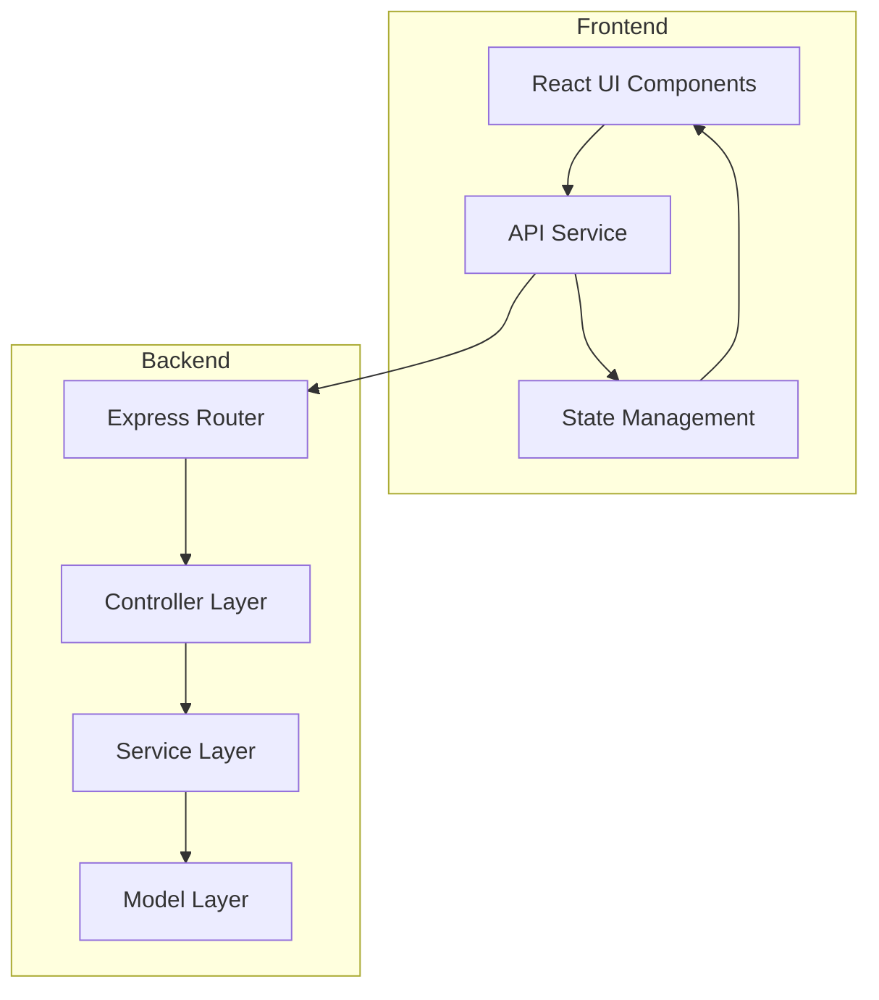
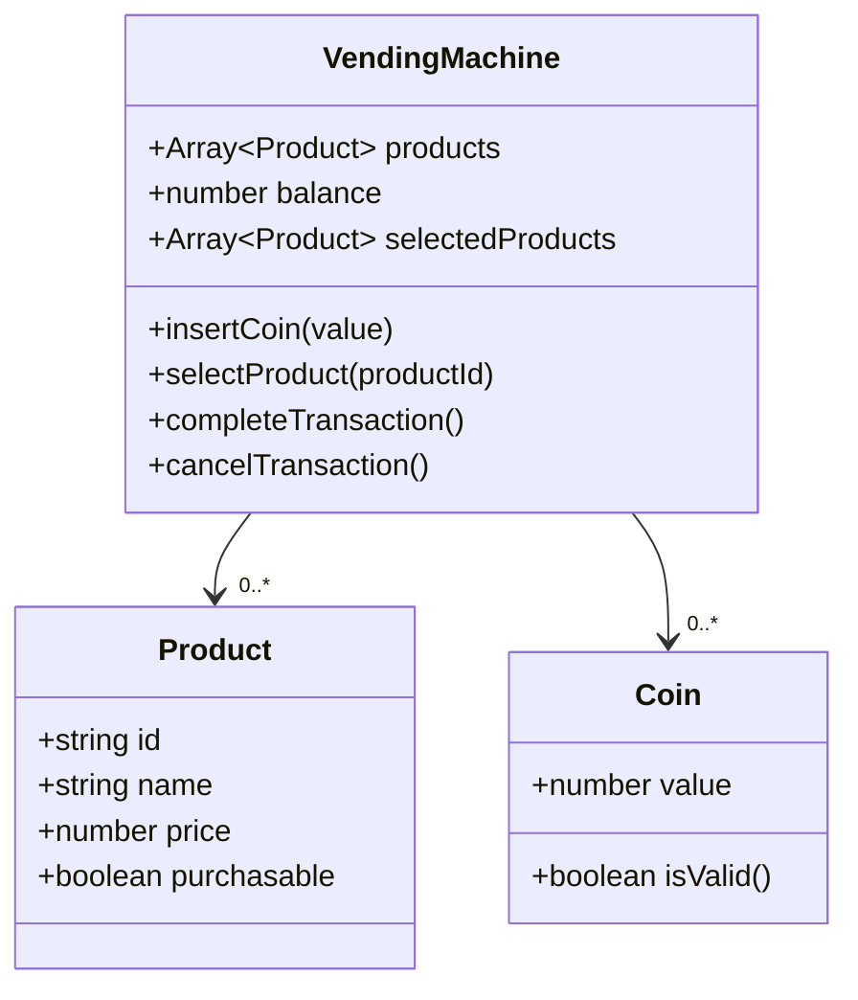

# Vending Machine Application

A modern vending machine application built with a Node.js backend API and React TypeScript frontend, featuring real-time balance updates, product management, and transaction handling.

## Architecture and Design

### System Architecture



### Class Diagram



## Features

### Backend API
- RESTful API design
- Modular architecture with clear separation of concerns
- Comprehensive test coverage
- Transaction management with optimal change calculation

### Frontend
- Modern React with TypeScript
- Real-time balance updates
- Interactive product selection
- Responsive design with Tailwind CSS

## API Documentation

### Using cURL

#### 1. Get all products
```bash
curl http://localhost:3000/api/products
```

#### 2. Insert a coin (5 MAD)
```bash
curl -X POST http://localhost:3000/api/coins \
  -H "Content-Type: application/json" \
  -d '{"value": 5}'
```

#### 3. Select a product
```bash
curl -X POST http://localhost:3000/api/products/1/select \
  -H "Content-Type: application/json"
```

#### 4. Complete transaction
```bash
curl -X POST http://localhost:3000/api/transaction/complete \
  -H "Content-Type: application/json"
```

#### 5. Cancel transaction
```bash
curl -X POST http://localhost:3000/api/transaction/cancel \
  -H "Content-Type: application/json"
```

## Frontend Screenshots

### Main Interface
[Add screenshot showing the main interface with available products]

### Product Selection
[Add screenshot showing product selection and cart]

### Transaction Complete
[Add screenshot showing transaction completion with change]

## Installation and Setup

### Prerequisites
- Node.js (v14 or higher)
- npm (v6 or higher)

### Quick Start

1. Clone and install dependencies:
```bash
git clone <repository-url>
cd vending-machine
npm install
```

2. Start the application:
```bash
# Start both frontend and backend
npm start

# Or start them separately:
npm run start:api     # Start backend only
npm run start:front   # Start frontend only
```

3. Access the application:
- Frontend: [http://localhost:5173](http://localhost:5173)
- Backend API: [http://localhost:3000](http://localhost:3000)

## Design Decisions

### 1. Coin Management
- Valid denominations: 0.5, 1, 2, 5, 10 MAD
- Optimal change calculation
- Real-time balance updates

### 2. Product Management
- Dynamic product availability
- Price-based purchase validation
- Real-time stock updates

### 3. Transaction Flow
- Multi-product selection support
- Atomic transaction processing
- Automatic change calculation

### 4. Error Handling
- Comprehensive input validation
- Clear error messages
- Graceful failure recovery
